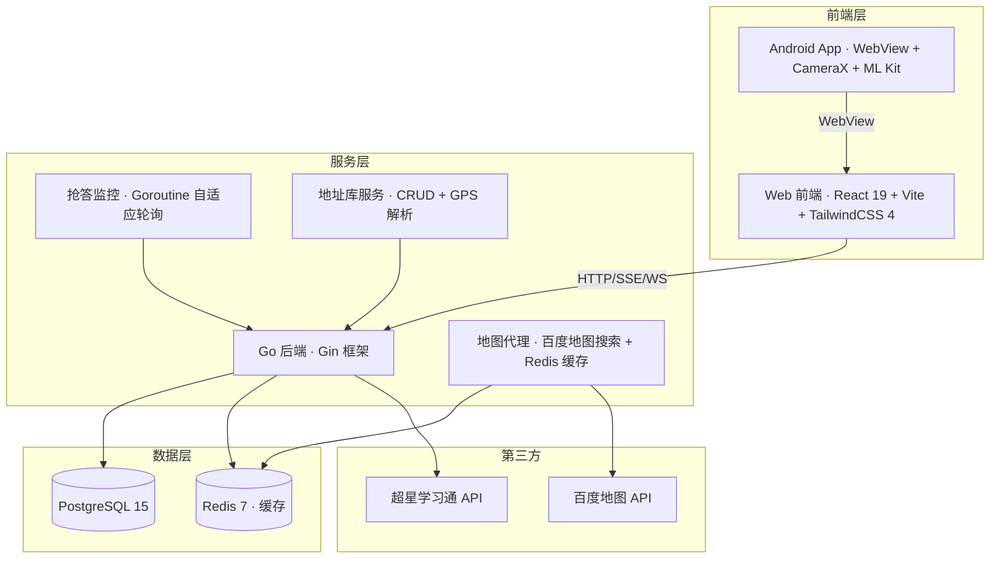

# XBT 学不通 2.0 Plus

<div align="center">

> 🔄 **本项目基于 [EnderWolf006/XBT](https://github.com/EnderWolf006/XBT) 进行二次开发**
>
> 感谢原作者的开源贡献与技术分享！

**超星学习通自动化工具集 | 三端协同签到系统**

[](#)
[](#)
[](#)
[](#)
[](#)
[](#)
[](#)
[](#)

</div>

---

## 📖 项目简介

**XBT（学不通 2.0）** 是一套面向超星学习通场景的全栈自动化工具，采用 **Web 管理端 + Go 后端 + Android 原生壳** 三端协同架构设计，为课程签到与课堂互动提供完整解决方案。

本项目在原项目基础上新增 **课堂抢答功能模块**、**地址库管理**、**拍照签到** 与 **百度地图集成**，实现实时监控、自动抢答、位置预设、照片批量分配、历史记录等完整能力。

---

## ✨ 核心功能

### 🎯 签到自动化

| 签到类型 | 支持状态 | 说明 |
|---------|---------|------|
| ✅ 普通签到 | 完全支持 | 一键执行 |
| ✅ 拍照签到 | 完全支持 | 本地上传/相机拍摄 + 批量分配 + 去重 |
| ✅ 二维码签到 | 完全支持 | 扫码解析 + 并发执行 + 重试机制 |
| ✅ 手势签到 | 完全支持 | 输入手势码提交 |
| ✅ 位置签到 | 完全支持 | 地址库预设 + GPS 定位 + 百度地图选点 |
| ✅ 签到码签到 | 完全支持 | 输入签到码提交 |

### 📸 拍照签到

- **照片上传**：支持本地上传 + 全屏相机实时拍摄，玻璃拟态 UI 预览
- **批量分配**：多用户自动轮换分配照片，支持去重，hover 预览放大
- **格式校验**：允许 PNG / JPG / GIF / WebP / BMP / HEIC，单文件上限 20MB
- **iOS 兼容**：修复 iOS Safari 相册选择 + FormData multipart 上传
- **预览管理**：添加/删除照片实时预览，序号角标，hover 渐显删除

### 🗺️ 地址库管理（位置签到）

- **百度地图集成**：百度 JS API v3.0，BD-09 坐标系
- **搜索代理**：后端统一代理 `/api/bmap/search`，Redis 缓存 24 小时
- **API Key 运行时配置**：无需修改文件，面板内输入 Key，localStorage 持久化
- **GPS 自动定位**：浏览器 GPS → 百度坐标转换 → 逆地理编码
- **地图选点器**：全屏百度地图选点，点击即选经纬度
- **精密坐标面板**：深空蓝黑渐变 + N/E 角标 + 等宽字体坐标显示
- **灵活字段**：标题（自己看）+ 地址名称（老师看）+ 描述
- **数据库持久化**：地址保存在数据库，重启不丢失
- **全设备视口适配**：`position: fixed` 方案解决 iOS/Android/桌面 vh/dvh 错乱

### ⚡ 课堂抢答

- **实时监控**：后台 Goroutine 自适应轮询（100ms~2s 动态调频）
- **自动抢答**：检测到抢答活动后毫秒级自动提交，支持重试
- **预发抢答**：检测到即将开始的活动进入极速模式（100ms 轮询）预热抢答
- **手动抢答**：支持一键手动触发抢答
- **延迟配置**：可设置 0~5000ms 延迟避开风控检测
- **课程过滤**：支持指定监控特定课程
- **实时推送**：SSE + WebSocket 双通道实时事件推送
- **历史记录**：完整记录抢答时间、排名、结果

### 👥 多人协作

- 多账号本地切换管理（Zustand + localStorage 持久化）
- 批量代签 + 状态实时跟踪
- 执行前自动过滤已签用户
- 失败重试（最多 5~15 次）+ 进度可视化
- 管理员白名单权限控制

---

## 🏗 技术架构

### 系统架构图



### 技术栈详情

| 层级 | 技术选型 |
|------|---------|
| **Web 前端** | React 19 + TypeScript + Vite + TailwindCSS 4 + Zustand + Axios |
| **UI 动画** | framer-motion + 纯 CSS 过渡（btn-tap、anim-slide-up 等） |
| **设计语言** | 玻璃拟态 (Glassmorphism) 2.0 + 精密仪器风格坐标面板 |
| **地图服务** | 百度地图 JS API v3.0（BD-09 坐标系） |
| **后端** | Go 1.22 + Gin + GORM + JWT + YAML 配置 |
| **实时推送** | SSE (Server-Sent Events) + WebSocket 双通道 |
| **缓存** | Redis 7（百度地图搜索 24h 缓存 + 可扩展） |
| **数据库** | PostgreSQL 15 |
| **Android** | Kotlin + Jetpack Compose + CameraX + ML Kit BarcodeScanning |
| **部署** | Docker + Docker Compose + Nginx 反向代理 |

### 数据库表结构

| 表名 | 说明 | 关键字段 |
|------|------|---------|
| `users` | 用户表 | uid, mobile, name, avatar, credential_cipher, permission |
| `whitelists` | 白名单 | mobile, permission |
| `courses` | 课程 | course_id, class_id, name, teacher, icon |
| `user_courses` | 用户课程关联 | user_uid, course_id, class_id, is_selected |
| `sign_activities` | 签到活动缓存 | activity_id, start_time, end_time, sign_type, if_photo |
| `sign_records` | 签到记录 | user_uid, activity_id, source_uid, sign_time_ms |
| `location_presets` | 地址库 | user_uid, name, latitude, longitude, description |
| `quiz_configs` | 抢答配置 | user_uid, enabled, auto_answer, delay_ms, course_id, class_id |
| `quiz_activities` | 抢答活动 | user_uid, activity_id, course_id, class_id, status |
| `quiz_records` | 抢答记录 | user_uid, activity_id, success, message |

---

## 📁 项目结构

```text
XBT/
├── Web/                              # 前端 React 19 SPA
│   ├── src/
│   │   ├── api/
│   │   │   ├── client.ts            # Axios 实例 + 拦截器（JWT、FormData）
│   │   │   ├── quiz.ts              # 抢答 API 客户端
│   │   │   └── location.ts          # 地址库 API 客户端
│   │   ├── components/
│   │   │   ├── location/
│   │   │   │   ├── BMapKeyConfig.tsx # 百度地图 Key 运行时配置
│   │   │   │   ├── BMapPicker.tsx    # 百度地图全屏选点器
│   │   │   │   ├── LiveLocationCard.tsx # 实时定位卡片（精密仪器风格）
│   │   │   │   └── LocationForm.tsx  # 地址表单
│   │   │   ├── sign/
│   │   │   │   ├── PhotoInput.tsx    # 拍照签到输入（玻璃卡片 + hover 预览）
│   │   │   │   ├── GestureInput.tsx  # 手势签到输入
│   │   │   │   ├── LocationInput.tsx # 位置签到输入
│   │   │   │   ├── NormalInput.tsx   # 普通签到输入
│   │   │   │   ├── PinInput.tsx      # 签到码输入
│   │   │   │   ├── QrInput.tsx       # 二维码签到输入
│   │   │   │   └── ProgressCard.tsx  # 签到进度卡片
│   │   │   ├── ui/
│   │   │   │   ├── Button.tsx        # 通用按钮
│   │   │   │   ├── IconButton.tsx    # 图标按钮
│   │   │   │   ├── Badge.tsx         # 徽章
│   │   │   │   ├── GlassCard.tsx     # 玻璃卡片
│   │   │   │   └── GlassPanel.tsx    # 玻璃面板
│   │   │   ├── ProtectedRoute.tsx    # 路由守卫
│   │   │   └── PullToRefresh.tsx     # 下拉刷新
│   │   ├── hooks/
│   │   │   ├── useLocationPanel.ts   # 地址库 CRUD + GPS 定位共享 Hook
│   │   │   └── useBMapKey.ts         # 响应式百度地图 Key 管理
│   │   ├── pages/
│   │   │   ├── Lobby.tsx             # 首页/签到大厅（含地址库面板）
│   │   │   ├── Login.tsx             # 登录页
│   │   │   ├── Courses.tsx           # 课程管理
│   │   │   ├── SignDetail.tsx        # 签到详情（地址选点 + 拍照签到）
│   │   │   ├── FullScanner.tsx       # 全屏扫码页（CameraX + QR 解析）
│   │   │   ├── FullPhoto.tsx         # 全屏拍照页
│   │   │   ├── Quiz.tsx              # 抢答功能页（控制/配置/日志三 Tab）
│   │   │   ├── AccountManagement.tsx # 多账号管理
│   │   │   └── Whitelist.tsx         # 白名单管理（管理员）
│   │   ├── store/
│   │   │   └── auth.ts               # Zustand 认证状态（多账号持久化）
│   │   ├── utils/
│   │   │   ├── bmap.ts               # 百度地图 SDK 集成（localStorage Key 回退）
│   │   │   ├── coords.ts             # 坐标转换工具
│   │   │   ├── datetime.ts           # 日期格式化
│   │   │   └── photoTransfer.ts      # 拍照页面照片传递（sessionStorage）
│   │   ├── types/
│   │   │   └── index.ts              # TypeScript 类型定义
│   │   ├── index.css                 # 全局样式（玻璃拟态 + 安全区 + 视口适配）
│   │   ├── App.tsx                   # 根组件（路由 + 布局）
│   │   └── main.tsx                  # 应用入口
│   ├── config.yaml                   # 前端配置
│   ├── nginx.conf                    # Nginx 配置
│   ├── Dockerfile                    # 前端 Docker 构建
│   └── index.html                    # HTML 入口（视口 JS 修复脚本）
│
├── Server/                            # Go 后端
│   ├── cmd/server/main.go            # 入口（路由注册 + DB/Redis 初始化）
│   ├── internal/
│   │   ├── common/
│   │   │   ├── authctx.go            # 认证上下文工具
│   │   │   ├── mask.go               # 手机号脱敏
│   │   │   └── response.go           # 统一响应格式
│   │   ├── config/
│   │   │   └── config.go             # YAML 配置加载
│   │   ├── db/
│   │   │   └── db.go                 # PostgreSQL 连接
│   │   ├── dto/
│   │   │   └── types.go              # 请求/响应 DTO
│   │   ├── handler/
│   │   │   ├── auth.go               # 登录处理
│   │   │   ├── bmap.go               # 百度地图搜索代理
│   │   │   ├── course.go             # 课程同步/选择
│   │   │   ├── location.go           # 地址库 CRUD
│   │   │   ├── sign.go               # 签到执行/拍照/检查
│   │   │   └── whitelist.go          # 白名单管理
│   │   ├── middleware/
│   │   │   └── auth.go               # JWT 认证 + 管理员鉴权中间件
│   │   ├── model/
│   │   │   └── models.go             # GORM 数据模型（10 张表）
│   │   ├── quiz/
│   │   │   ├── handler/quiz.go       # 抢答 HTTP 处理器 + SSE + WS
│   │   │   ├── model/models.go       # 抢答数据模型
│   │   │   └── service/
│   │   │       ├── monitor.go        # 抢答监控核心服务
│   │   │       └── wshub.go          # WebSocket Hub 连接管理
│   │   ├── service/
│   │   │   ├── crypto.go             # AES 凭证加解密
│   │   │   ├── jwt.go                # JWT 签发/验证
│   │   │   └── sign.go               # 签到核心逻辑
│   │   └── xxt/
│   │       ├── client.go             # 超星 API 客户端
│   │       ├── captcha.go            # 验证码处理
│   │       ├── crypto.go             # 超星 AES 加解密
│   │       ├── utils.go              # 工具函数
│   │       └── websocket.go          # 超星 WebSocket
│   ├── config_example.yaml           # 配置文件示例
│   ├── init.sql                      # 数据库初始化 SQL
│   ├── Dockerfile                    # 后端 Docker 构建
│   ├── go.mod                        # Go 模块定义
│   └── API.md                        # API 接口文档
│
├── Android/                           # Android 原生壳
│   ├── app/src/main/java/com/github/enderwolf006/xbt/
│   │   ├── MainActivity.kt           # WebView 容器 + CameraX 原生相机桥
│   │   └── ui/theme/                 # Material 3 主题
│   ├── app/build.gradle.kts          # Gradle 构建配置
│   └── settings.gradle.kts
│
├── docker-compose.yml                 # 一键部署编排
│   ├── postgres (5433:5432)           # PostgreSQL 15
│   ├── redis (6375:6379)              # Redis 7
│   ├── xbt-server (8083:8080)         # Go 后端
│   └── xbt-web (8092:80)              # Nginx + React
│
├── DEPLOYMENT.md                      # 部署文档
├── QUIZ_FEATURE.md                    # 抢答功能技术文档
├── CHANGES.md                         # 变更日志
├── LICENSE                            # 开源协议
└── README.md                          # 本文件
```

---

## 🚀 快速开始

### Docker 一键部署

```bash
# 1. 克隆项目
git clone https://github.com/Gin0715/XBT.git
cd XBT

# 2. 可选：修改 docker-compose.yml 中的 JWT_SECRET 和 CREDENTIAL_SECRET

# 3. 启动所有服务
docker-compose up -d

# 4. 访问
# 前端: http://localhost:8092
# 后端: http://localhost:8083
```

### 本地开发

详见 [DEPLOYMENT.md](./DEPLOYMENT.md) 完整部署指南。

### 🗺️ 百度地图配置

**方式一：运行时配置（推荐）**
打开任意页面的地址库面板 → 点击 Key 状态指示器 → 输入百度地图 API Key → 保存即可，**无需重启服务**。

**方式二：后端代理配置**
在 `Server/config.yaml` 中配置：
```yaml
baidu_map_ak: "你的百度地图AK"
redis_addr: "127.0.0.1:6379"
```

> 前往 [百度地图开放平台](https://lbsyun.baidu.com/apiconsole/key) 申请密钥，应用类型选择「**浏览器端**」。

### 🔧 配置文件说明

**后端** (`Server/config_example.yaml` → 复制为 `config.yaml`)：

| 配置项 | 说明 | 默认值 |
|--------|------|--------|
| `app_env` | 运行环境 (prod/dev/test) | prod |
| `http_addr` | 监听地址 | :3030 |
| `jwt_secret` | JWT 签名密钥 | 需修改 |
| `credential_secret` | 凭证加密密钥 | 需修改 |
| `postgres_dsn` | 数据库连接串 | 需修改 |
| `redis_addr` | Redis 地址 | 127.0.0.1:6379 |
| `baidu_map_ak` | 百度地图 API Key | 需填写 |
| `chaoxing_aes_key` | 超星 AES 密钥 | 保持默认 |
| `activity_list_limit` | 每课程活动上限 | 5 |

---

## 🎨 UI 设计系统

### 玻璃拟态 (Glassmorphism) 2.0

使用精细的 `backdrop-filter: blur()` + `saturate()` 组合，配合 6 种玻璃效果：

| 类名 | 效果 | 应用场景 |
|------|------|---------|
| `.glass` | 基础玻璃 (blur 16px) | 导航栏、卡片 |
| `.glass-strong` | 强玻璃 (blur 24px) | 弹窗、底部面板 |
| `.glass-dark` | 暗玻璃 (blur 20px) | 深色背景卡片 |
| `.glass-frost` | 磨砂玻璃 (blur 32px) | 背景装饰层 |
| `.glass-edge` | 边缘高光线 | 卡片顶部装饰 |
| `.glass-sheet` | 底栏玻璃 (blur 28px) | 底部弹出面板 |
| `.glass-hover` | 磁吸悬停效果 | 交互卡片 |

### 性能动画工具类

使用纯 CSS 过渡替代 JS 驱动动画，减少主线程负担：

| 类名 | 效果 |
|------|------|
| `btn-tap` / `btn-tap-sm` | 点击缩放（will-change: transform） |
| `btn-hover-lift` | 悬停上浮 |
| `anim-slide-up` / `anim-fade-in` | 入场动画 |
| `gpu-layer` | `translateZ(0)` 触发 GPU 合成 |
| `btn-pulse-green` / `btn-pulse-blue` | box-shadow 脉冲动画 |

### 全设备视口适配

采用 `position: fixed` 方案锁定 body 为实际可见区域，配合 JS 脚本动态设置 `--app-height` CSS 变量：

- **iOS**：`env(safe-area-inset-*)` 安全区适配 + visualViewport 事件监听
- **Android**：`-webkit-fill-available` 兜底 + 导航栏安全区
- **桌面**：标准百分比布局，100% 继承 fixed body 高度

---

## 📚 文档导航

| 文档 | 说明 |
|------|------|
| [DEPLOYMENT.md](./DEPLOYMENT.md) | 完整部署与运维指南 |
| [QUIZ_FEATURE.md](./QUIZ_FEATURE.md) | 抢答功能详细技术文档 |
| [CHANGES.md](./CHANGES.md) | 全部版本变更日志 |
| [Server/API.md](./Server/API.md) | 后端接口完整说明 |

---

## ⚠️ 免责声明

本项目仅用于 **技术研究与学习交流** 目的。请使用者严格遵守：

- 学校相关管理规定
- 超星学习通平台用户协议
- 国家相关法律法规

**请勿用于任何违规场景，使用者需自行承担相应责任。**

---

## 🙏 致谢

- 特别感谢原作者 **[@EnderWolf006](https://github.com/EnderWolf006)** 的开源贡献
- 本项目基于 [EnderWolf006/XBT](https://github.com/EnderWolf006/XBT) 进行二次开发

---

## 📝 更新日志

### v2.3 — 2026-06-09

**🔧 全设备视口布局修复 + iOS 相册上传修复**

| 类别 | 变更项 |
|------|--------|
| 📱 视口适配 | body `position:fixed` + JS `--app-height` 方案，替换全局 `100dvh`/`100vh` 为 `%` 单位 |
| 🔒 安全区 | 新增 `pb-safe-*`/`pt-safe-*`/`mb-safe-*`/`bottom-safe-*` 共 14 个安全区工具类 |
| 📸 iOS 上传 | FormData 显式 filename、axios Content-Type 删除、`accept` 显式 MIME 列表、HEIC 双重校验 |
| 🧹 布局 | 修复扫码页底部三按钮居中、等间距、安全区适配 |

### v2.2 — 2026-06-08

- 🎨 UI 全面重构：6 种玻璃效果 + 10+ 性能 CSS 工具类
- 🔑 地图 Key 运行时配置 + 跨组件响应式同步
- 📡 定位卡片精密仪器风格重写

### v2.1 — 2026-06-08

- 📸 拍照签到完整功能
- 🗺️ 高德地图 → 百度地图引擎迁移

### v2.0 — 2025-Q2

- ✨ 抢答功能模块（Goroutine 监控 + SSE/WS 推送）
- 📍 地址库 CRUD
- 🐳 Docker Compose 一键部署
- 📱 Android WebView 原生壳 + CameraX 扫码
