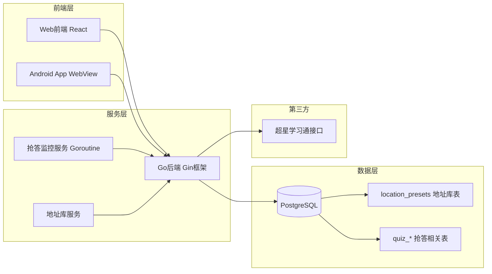

# XBT 学不通 2.0 Plus

<div align="center">

> 🔄 **本项目基于 [EnderWolf006/XBT](https://github.com/EnderWolf006/XBT) 进行二次开发**
>
> 感谢原作者的开源贡献与技术分享！

**超星学习通自动化工具集 | 三端协同签到系统**

[](#)
[](#)
[](#)
[](#)
[](#)
[](#)
[](#)

</div>

---

## 📖 项目简介

**XBT（学不通 2.0）** 是一套面向超星学习通场景的全栈自动化工具，采用 **Web管理端 + Go后端 + Android原生壳** 三端协同架构设计，为课程签到与课堂互动提供完整解决方案。

本项目在原项目基础上新增 **课堂抢答功能模块** 与 **地址库管理**，实现实时监控、自动抢答、位置预设、历史记录等完整能力。

---

## ✨ 核心功能

### 🎯 签到自动化

| 签到类型 | 支持状态 | 说明 |
|---------|---------|------|
| ✅ 普通签到 | ✅ 完全支持 | 一键执行 |
| ✅ **拍照签到** | ✅ 完全支持 | 上传照片签到 + 批量分配 + 去重 |
| ✅ 二维码签到 | ✅ 完全支持 | 扫码解析 + 并发执行 |
| ✅ 手势签到 | ✅ 完全支持 | 输入手势码提交 |
| ✅ **位置签到** | ✅ 完全支持 | **地址库 + 自定义经纬度** |
| ✅ 签到码签到 | ✅ 完全支持 | 输入签到码提交 |

### 📸 拍照签到

- **照片上传**：支持本地上传 + 相机实时拍摄，玻璃拟态 UI 预览
- **批量分配**：多用户自动分配照片，支持轮换去重，hover 预览放大
- **格式校验**：仅允许常见图片格式（PNG / JPG / GIF / WebP / BMP / HEIC），单文件上限 20MB
- **预览管理**：添加/删除照片实时预览，序号角标，hover 渐显删除
- **跳转拍照**：一键跳转全屏拍照页，拍摄后返回不丢失已选照片，支持前置/后置切换

### 🗺️ 地址库管理（位置签到）

> 🗺️ 地图引擎：百度地图 (Baidu Maps) v3.0 — 支持自动定位与手动选点

- **百度地图集成**：使用百度 JS API v3.0，精准 BD-09 坐标系
- **地址搜索代理**：前端地址关键词搜索通过后端 `/api/bmap/search` 统一代理，后端 Redis 缓存 24 小时，显著降低百度地图 QPS
- **API Key 运行时配置**：**无需修改 .env**，可直接在地址库面板中输入 Key，保存到 localStorage，支持显示/隐藏/清除
- **自动获取定位**：点击「获取定位」按钮，浏览器 GPS 自动获取当前位置并填入坐标
- **精密坐标仪表盘**：仪器风格 N/E 角标 + 等宽字体坐标显示，一目了然
- **手动地图选点**：点击「选点」按钮，打开百度地图全屏选点器，点击任意位置即可选取经纬度
- **逆地理编码**：选点或定位后自动解析详细地址（省/市/区/街道/POI）
- **灵活字段设计**：
  - **标题**（自己看）：方便自己管理和识别地点
  - **地址名称**（老师看）：签到时展示给老师的地址信息
- **一键选择**：位置签到时直接从地址库选择，无需重复输入
- **灵活配置**：支持新增、编辑、删除地址
- **数据库持久化**：所有地址保存在数据库，重启不丢失
- **干净初始化**：无默认硬编码地址，完全由用户自主管理

### ⚡ 课堂抢答

- **实时监控**：后台自动轮询检测抢答活动
- **自动抢答**：检测到活动后毫秒级自动提交
- **手动抢答**：支持一键手动触发抢答
- **延迟配置**：可设置50-200ms延迟避免检测
- **课程过滤**：支持指定监控特定课程
- **历史记录**：完整记录抢答时间、排名、结果

### 👥 多人协作

- 多账号本地切换管理
- 批量代签 + 状态实时跟踪
- 执行前自动过滤已签用户
- 失败重试 + 进度可视化
- 管理员白名单权限控制

---

## 🏗 技术架构

### 系统架构图



### 技术栈详情

| 层级 | 技术选型 |
|------|---------|
| **前端 Web** | React 19 + TypeScript + Vite + TailwindCSS 4 + Zustand + Axios |
| **地图服务** | 百度地图 v3.0（BD-09 坐标系）— 自动定位 + 逆地理编码 + 地图选点 |
| **UI 动画** | framer-motion + **纯 CSS 过渡优化**（btn-tap、anim-slide-up 等性能工具类） |
| **设计语言** | 玻璃拟态 (Glassmorphism) + 精密仪器风格坐标面板 |
| **后端 Server** | Go 1.22 + Gin + GORM + JWT + YAML + Redis 缓存代理 |
| **缓存服务** | Redis（百度地图关键词搜索结果 24 小时缓存） |
| **移动端 Android** | Kotlin + Jetpack Compose + CameraX + ML Kit |
| **数据库** | PostgreSQL 14+ |
| **部署** | Docker + Docker Compose |

---

## 📁 项目结构

```text
XBT/
├── Web/                          # 前端 React
│   ├── src/
│   │   ├── pages/               # 业务页面
│   │   │   ├── Quiz.tsx         # 抢答功能页面
│   │   │   ├── Lobby.tsx        # 首页/签到大厅（含地址库面板）
│   │   │   ├── Courses.tsx      # 课程管理
│   │   │   ├── SignDetail.tsx   # 签到详情（含地址库选点/拍照签到）
│   │   │   ├── FullPhoto.tsx     # 📸 全屏拍照页（玻璃效果 UI）
│   │   │   └── ...
│   │   ├── components/
│   │   │   ├── sign/
│   │   │   │   ├── PhotoInput.tsx    # 拍照签到输入组件（玻璃卡片 + hover 预览）
│   │   │   │   └── ...
│   │   │   └── location/
│   │   │       ├── LocationForm.tsx  # 地址表单（标题/地址名称/经纬度）
│   │   │       ├── BMapPicker.tsx    # 🗺️ 百度地图全屏选点器
│   │   │       ├── BMapKeyConfig.tsx # 🔑 百度地图 API Key 运行时配置组件
│   │   │       └── LiveLocationCard.tsx # 📡 实时定位卡片（精密仪器风格）
│   │   ├── hooks/
│   │   │   ├── useLocationPanel.ts  # 地址库 CRUD + 定位逻辑共享 Hook
│   │   │   └── useBMapKey.ts        # 响应式百度地图 Key 管理（跨组件同步）
│   │   ├── api/
│   │   │   ├── quiz.ts          # 抢答API
│   │   │   └── location.ts      # 地址库API
│   │   ├── utils/
│   │   │   ├── bmap.ts          # 百度地图 SDK 集成（支持 localStorage Key 回退）
│   │   │   └── amap.ts          # 高德地图（已弃用，保留兼容）
│   │   └── store/               # Zustand 状态管理
│   └── .env                     # 含 VITE_BAIDU_MAP_KEY 配置
│
├── Server/                       # 后端 Go
│   ├── cmd/server/main.go        # 入口
│   ├── internal/
│   │   ├── quiz/                 # ✨ 抢答模块
│   │   ├── handler/
│   │   │   ├── bmap.go           # 🧭 百度地图搜索代理接口
│   │   │   ├── location.go       # 📍 地址库接口
│   │   │   └── sign.go           # 签到接口
│   │   ├── model/
│   │   │   └── models.go         # 含 LocationPreset 模型
│   │   └── middleware/
│   ├── config.yaml               # 后端配置
│   ├── init.sql                  # 含 location_presets 表
│   └── API.md
│
├── Android/                      # Android 原生壳
├── docker-compose.yml
├── QUIZ_FEATURE.md
├── DEPLOYMENT.md
└── README.md
```

---

## 🎨 UI 设计亮点

### 玻璃拟态 (Glassmorphism) 2.0

使用精细的 `backdrop-filter: blur()` + `saturate()` 组合，配合 6 种玻璃效果类：

| 类名 | 效果 | 应用 |
|------|------|------|
| `.glass` | 基础玻璃 (blur 16px) | 导航栏、卡片 |
| `.glass-strong` | 强玻璃 (blur 24px) | 弹窗、底部面板 |
| `.glass-frost` | 磨砂玻璃 (blur 32px) | 背景装饰层 |
| `.glass-sheet` | 底栏玻璃 | 底部弹出面板 |
| `.glass-edge` | 边缘高光线 | 卡片顶部装饰 |
| `.glass-hover` | 磁吸悬停效果 | 交互卡片 |

### 动画性能优化

使用纯 CSS 过渡替代 framer-motion JS 驱动动画，减少主线程负担：

- `btn-tap` / `btn-tap-sm` — 点击缩放（`will-change: transform`）
- `btn-hover-lift` — 悬停上浮
- `anim-slide-up` / `anim-fade-in` — 入场动画
- `gpu-layer` — `transform: translateZ(0)` 触发 GPU 合成
- `btn-pulse-green` / `btn-pulse-blue` — box-shadow 脉冲动画

### 实时定位卡片 — 精密仪器风格

- 深空蓝黑渐变背景 + 动态光晕 + SVG 网格纹理
- N/E 角标 + 等宽字体坐标显示（经纬度精确到 6 位）
- 三态切换：空状态引导 → 卫星弹跳加载 → 精密坐标面板
- 深色玻璃地址卡片 + 左侧装饰条

---

## 🚀 快速开始

### Docker 一键部署

```bash
# 1. 克隆项目
git clone https://github.com/Gin0715/XBT.git
cd XBT

# 2. 启动服务
docker-compose up -d

# 3. 访问
# 前端: http://localhost
# 后端: http://localhost:8080
```

### 本地开发

详见 [DEPLOYMENT.md](./DEPLOYMENT.md) 完整部署指南

### 🗺️ 百度地图配置

**方式一：运行时配置（推荐）**
打开地址库面板 → 点击 Key 状态指示器 → 输入 API Key → 保存即可，**无需重启服务**

**方式二：环境变量配置**
```bash
# 编辑 Web/.env
VITE_BAIDU_MAP_KEY=你的百度地图AK
```

### 🔧 后端 Redis & 代理配置

后端通过 `/api/bmap/search` 代理百度地图关键词搜索，减少前端直接请求次数。
请在 `Server/config.yaml` 中补充：

```yaml
redis_addr: "127.0.0.1:6379"
redis_password: ""
redis_db: 0
baidu_map_ak: "your_baidu_map_api_key"
```

> ⚠️ 方式一优先：运行时配置保存到 localStorage，优先级高于 `.env`
> 前往 [百度地图开放平台](https://lbsyun.baidu.com/apiconsole/key) 申请密钥，应用类型选择「**浏览器端**」

### 🧭 地址库坐标拾取工具

如需手动获取坐标，可使用百度官方工具：
👉 [https://lbs.baidu.com/maptool/getpoint](https://lbs.baidu.com/maptool/getpoint)

---

## 📚 文档导航

| 文档 | 说明 |
|------|------|
| [QUIZ_FEATURE.md](./QUIZ_FEATURE.md) | 抢答功能详细技术文档 |
| [DEPLOYMENT.md](./DEPLOYMENT.md) | 完整部署与运维指南 |
| [Server/API.md](./Server/API.md) | 后端接口完整说明 |

---

## ⚠️ 免责声明

本项目仅用于 **技术研究与学习交流** 目的。请使用者严格遵守：

- 学校相关管理规定
- 超星学习通平台用户协议
- 国家相关法律法规

**请勿用于任何违规场景，使用者需自行承担相应责任。**

---

## 📝 更新日志

### v2.2 — 2026-06-08

**🎨 UI 全面重构 & 性能优化**

| 类别 | 变更项 | 详情 |
|------|--------|------|
| **🔑 API Key** | 运行时配置 | 无需修改 `.env`，地址库面板直接输入 Key，保存到 localStorage，支持显示/隐藏/清除 |
| **🔄 Key 同步** | 跨组件响应式 | 新建 `useBMapKey` hook，storage 事件 + 自定义事件双通道同步，同一页面多实例自动一致 |
| **📡 定位卡片** | 精密仪器风格重写 | 深空蓝黑渐变背景、N/E 角标坐标、动态光晕、网格纹理、三态切换动画 |
| **📍 地址显示** | 优化布局 | 主地址大字 + POI/区域/城市紧凑标签行，左侧装饰条，消除布局跳动 |
| **📸 拍照签到** | 玻璃效果 UI | 渐变色图标、hover 放大预览、序号角标、hover 渐显删除 |
| **⚡ 动画性能** | CSS 替代 framer-motion | 新增 10+ 性能 CSS 工具类（btn-tap、anim-slide-up、gpu-layer），减少 JS 主线程负担 |
| **🧊 玻璃拟态** | 6 种玻璃效果 | 新增 glass-frost、glass-sheet、glass-edge、glass-hover 等 CSS 类 |
| **📱 三端自适应** | 面板宽度响应式 | 面板宽度 `w-full → sm:460px → md:500px`，适配安卓/iOS/桌面 |
| **🧩 地址库 Hook** | 逻辑共享 | 抽取 `useLocationPanel` hook，Lobby + SignDetail 共用 CRUD + 定位逻辑 |
| **🗺️ 地图 Key 配置** | 全宽卡片模式 | 未配置时醒目红框引导，已配置时绿色状态栏 + 折叠修改 |

**新增文件：**
| 文件 | 说明 |
|------|------|
| `Web/src/hooks/useLocationPanel.ts` | 地址库 CRUD + 定位共享 Hook |
| `Web/src/hooks/useBMapKey.ts` | 响应式地图 Key 管理 Hook |
| `Web/src/components/location/BMapKeyConfig.tsx` | API Key 配置组件（compact/fullWidth/默认三模式） |
| `Web/src/components/location/LiveLocationCard.tsx` | 实时定位卡片（精密仪器风格） |

**修改文件：**
| 文件 | 变更 |
|------|------|
| `Web/src/utils/bmap.ts` | 新增 `getBMapKey/setBMapKey/clearBMapKey/reloadBMapWithKey`，支持 localStorage 回退 |
| `Web/src/pages/Lobby.tsx` | 改用 `useLocationPanel` Hook + `BMapKeyConfig fullWidth` + `LiveLocationCard`，移除 ~70 行重复 |
| `Web/src/pages/SignDetail.tsx` | 同上，移除 ~100 行重复，优化动画性能 |
| `Web/src/components/sign/PhotoInput.tsx` | 完全重写 — 玻璃效果、hover 预览、序号角标 |
| `Web/src/components/location/LocationForm.tsx` | 配合 hook 重构 |
| `Web/src/index.css` | 新增 10+ 性能 CSS 工具类 + 6 种玻璃效果类 |
| `Web/src/components/location/BMapPicker.tsx` | 优化性能 |

### v2.1 — 2026-06-08

**📸 拍照签到 + 🗺️ 地址库升级**

| 变更项 | 详情 |
|--------|------|
| 📸 拍照签到 | 支持本地上传/相机拍摄，批量分配，20MB 上限，格式校验 |
| 🗺️ 地图引擎 | AMap (GCJ-02) → **Baidu Maps v3.0 (BD-09)** |

**🗺️ 地址库升级：高德地图 → 百度地图**

| 变更项 | 详情 |
|--------|------|
| 地图引擎 | AMap (GCJ-02) → **Baidu Maps v3.0 (BD-09)** |
| 自动定位 | GPS → 百度坐标转换 → 逆地理编码 |
| 手动选点 | 新增 `BMapPicker` 全屏地图选点器，点击即选 |
| 表单字段 | 「位置名称」→ **标题（自己看）** · 「地址描述」→ **地址名称（老师看）** |
| 新增文件 | `Web/src/utils/bmap.ts` · `Web/src/components/location/BMapPicker.tsx` |
| 修改文件 | `LocationForm.tsx` · `SignDetail.tsx` · `Lobby.tsx` · `main.tsx` · `.env` |
| 环境变量 | 新增 `VITE_BAIDU_MAP_KEY`（百度地图 AK） |
| 兼容性 | 旧 `amap.ts` 保留，无外部引用，不影响编译 |

### v2.0 — 2025-Q2

- ✨ 新增课堂抢答功能模块（实时监控 + 自动抢答）
- 📍 新增地址库管理（位置预设 CRUD）
- 🐳 Docker Compose 一键部署
- 📱 Android WebView 壳 + CameraX 扫码

---

## 🙏 致谢

- 特别感谢原作者 **[@EnderWolf006](https://github.com/EnderWolf006)** 的开源贡献
- 本项目基于 [EnderWolf006/XBT](https://github.com/EnderWolf006/XBT) 进行二次开发
