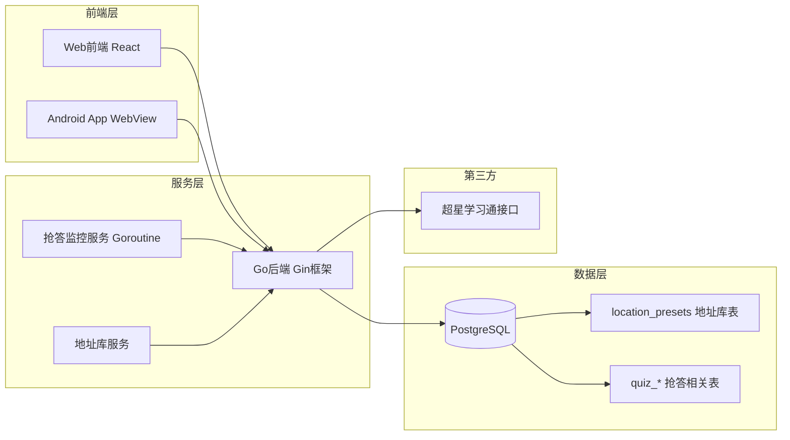

# XBT 学不通 2.0 Plus

<div align="center">

> 🔄 **本项目基于 [EnderWolf006/XBT](https://github.com/EnderWolf006/XBT) 进行二次开发**
>
> 感谢原作者的开源贡献与技术分享！

**超星学习通自动化工具集 | 三端协同签到系统**

[](#)
[](#)
[](#)
[](#)
[](#)
[](#)
[](#)

</div>

---

## 📖 项目简介

**XBT（学不通 2.0）** 是一套面向超星学习通场景的全栈自动化工具，采用 **Web管理端 + Go后端 + Android原生壳** 三端协同架构设计，为课程签到与课堂互动提供完整解决方案。

本项目在原项目基础上新增 **课堂抢答功能模块** 与 **地址库管理**，实现实时监控、自动抢答、位置预设、历史记录等完整能力。

---

## ✨ 核心功能

### 🎯 签到自动化

| 签到类型 | 支持状态 | 说明 |
|---------|---------|------|
| ✅ 普通签到 | ✅ 完全支持 | 一键执行 |
| ✅ 二维码签到 | ✅ 完全支持 | 扫码解析 + 并发执行 |
| ✅ 手势签到 | ✅ 完全支持 | 输入手势码提交 |
| ✅ **位置签到** | ✅ 完全支持 | **地址库 + 自定义经纬度** |
| ✅ 签到码签到 | ✅ 完全支持 | 输入签到码提交 |

### 📍 地址库管理（位置签到）

- **预设地址库**：支持添加常用签到地点（名称 + 经纬度 + 描述）
- **一键选择**：位置签到时直接从地址库选择，无需重复输入
- **灵活配置**：支持新增、编辑、删除地址
- **数据库持久化**：所有地址保存在数据库，重启不丢失
- **干净初始化**：无默认硬编码地址，完全由用户自主管理

### ⚡ 课堂抢答

- **实时监控**：后台自动轮询检测抢答活动
- **自动抢答**：检测到活动后毫秒级自动提交
- **手动抢答**：支持一键手动触发抢答
- **延迟配置**：可设置50-200ms延迟避免检测
- **课程过滤**：支持指定监控特定课程
- **历史记录**：完整记录抢答时间、排名、结果

### 👥 多人协作

- 多账号本地切换管理
- 批量代签 + 状态实时跟踪
- 执行前自动过滤已签用户
- 失败重试 + 进度可视化
- 管理员白名单权限控制

---

## 🏗 技术架构

### 系统架构图



### 技术栈详情

| 层级 | 技术选型 |
|------|---------|
| **前端 Web** | React 19 + TypeScript + Vite + TailwindCSS 4 + Zustand |
| **后端 Server** | Go 1.25 + Gin + GORM + JWT + YAML |
| **移动端 Android** | Kotlin + Jetpack Compose + CameraX + ML Kit |
| **数据库** | PostgreSQL 14+ |
| **部署** | Docker + Docker Compose |

---

## 📁 项目结构

```text
XBT/
├── Web/                          # 前端 React
│   ├── src/
│   │   ├── pages/               # 业务页面
│   │   │   ├── Quiz.tsx         # 抢答功能页面
│   │   │   ├── Lobby.tsx        # 首页/签到大厅
│   │   │   ├── Courses.tsx      # 课程管理
│   │   │   └── ...
│   │   ├── api/
│   │   │   ├── quiz.ts          # 抢答API
│   │   │   └── location.ts      # 地址库API
│   │   └── store/               # Zustand 状态管理
│   └── config.yaml              # 前端配置
│
├── Server/                       # 后端 Go
│   ├── cmd/server/main.go        # 入口
│   ├── internal/
│   │   ├── quiz/                 # ✨ 抢答模块
│   │   ├── handler/
│   │   │   ├── location.go       # 📍 地址库接口
│   │   │   └── sign.go           # 签到接口
│   │   ├── model/
│   │   │   └── models.go         # 含 LocationPreset 模型
│   │   └── middleware/
│   ├── config.yaml               # 后端配置
│   ├── init.sql                  # 含 location_presets 表
│   └── API.md
│
├── Android/                      # Android 原生壳
├── docker-compose.yml
├── QUIZ_FEATURE.md
├── DEPLOYMENT.md
└── README.md
```

---

## 🚀 快速开始

### Docker 一键部署

```bash
# 1. 克隆项目
git clone https://github.com/Gin0715/XBT.git
cd XBT

# 2. 启动服务
docker-compose up -d

# 3. 访问
# 前端: http://localhost
# 后端: http://localhost:8080
```

### 本地开发

详见 [DEPLOYMENT.md](./DEPLOYMENT.md) 完整部署指南

---

## 📚 文档导航

| 文档 | 说明 |
|------|------|
| [QUIZ_FEATURE.md](./QUIZ_FEATURE.md) | 抢答功能详细技术文档 |
| [DEPLOYMENT.md](./DEPLOYMENT.md) | 完整部署与运维指南 |
| [Server/API.md](./Server/API.md) | 后端接口完整说明 |

---

## ⚠️ 免责声明

本项目仅用于 **技术研究与学习交流** 目的。请使用者严格遵守：

- 学校相关管理规定
- 超星学习通平台用户协议
- 国家相关法律法规

**请勿用于任何违规场景，使用者需自行承担相应责任。**

---

## 🙏 致谢

- 特别感谢原作者 **[@EnderWolf006](https://github.com/EnderWolf006)** 的开源贡献
- 本项目基于 [EnderWolf006/XBT](https://github.com/EnderWolf006/XBT) 进行二次开发