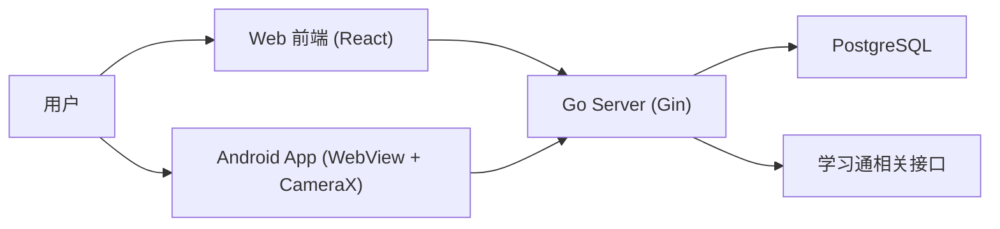

# 学不通 2.0 (XBT2.0)

> 一套面向学习通签到场景的三端协同系统：`Web 管理端` + `Go 后端` + `Android 原生壳`

[](#)
[](#)
[](#)
[](#)
[](#)

---

## 项目简介

学不通 2.0 是一个围绕课程签到管理与执行的工具型项目，核心能力包括：

- 学习通账号登录与鉴权
- 课程同步与监控课程选择
- 签到活动聚合展示（按课程分组）
- 多人代签与状态跟踪
- 多签到类型支持（普通 / 二维码 / 手势 / 位置 / 签到码）
- 管理员白名单维护（单条添加、批量导入、删除）
- 多账号本地切换

---

## 核心特性

### 1) 三端协同架构

- `Web`：主业务 UI，负责课程配置、活动查看、签到执行、白名单管理
- `Server`：鉴权、课程与活动数据聚合、签到执行、权限控制
- `Android`：WebView 容器 + 原生相机桥接，提升扫码体验与机型兼容性

### 2) 多类型签到统一流程

- 普通签到：直接执行
- 手势 / 签到码：输入 `sign_code` 执行
- 位置签到：选择预设地点后提交经纬度与地点描述
- 二维码签到：扫码后自动解析 `enc/c` 并并发执行

### 3) 并发执行 + 重试机制

- 执行前先调用 `/api/sign/check` 过滤已签用户
- 对待签用户并发调用 `/api/sign/execute`
- 内置失败重试与进度可视化，支持中断

### 4) 权限模型清晰

- `permission = 1`：普通用户
- `permission = 2`：管理员
- 管理端白名单接口仅管理员可访问

---

## 技术栈

### Web (`/Web`)

- React 19 + TypeScript
- Vite 8
- TailwindCSS 4
- Zustand（本地多账号状态管理）
- Axios（统一请求/鉴权拦截）
- Framer Motion（动效）
- html5-qrcode（浏览器扫码）

### Server (`/Server`)

- Go 1.25
- Gin
- GORM
- PostgreSQL
- JWT 鉴权
- YAML 配置加载

### Android (`/Android`)

- Kotlin + Jetpack Compose
- WebView 容器化
- CameraX + ML Kit（原生扫码）
- JavaScript Bridge（原生相机与 Web 页面通信）

---

## 系统架构



---

## 目录结构

```text
XBT2.0
├── Web/                  # React 前端
│   ├── src/pages/        # 业务页面（登录、课程、签到、白名单、账号管理、扫码）
│   ├── src/components/   # 组件（签到输入、下拉刷新、路由保护等）
│   ├── src/store/        # Zustand 状态（账号/Token）
│   └── config.yaml       # 前端配置（API、位置预设）
├── Server/               # Go 后端
│   ├── cmd/server/       # 入口
│   ├── internal/         # 业务逻辑（handler/service/middleware/...）
│   ├── config.yaml       # 后端配置
│   ├── init.sql          # PostgreSQL 初始化脚本
│   └── API.md            # 接口文档
├── Android/              # Android 原生壳
└── README.md
```

---

## 快速开始（本地开发）

### 0) 环境要求

- Node.js 20+
- Go 1.25+
- PostgreSQL 14+（项目脚本按 PostgreSQL 18+ 编写，低版本一般也可用）
- Android Studio（如需构建移动端）

### 1) 初始化数据库

```bash
# 示例：创建数据库后执行
psql -U <user> -d <dbname> -f Server/init.sql
```

### 2) 启动后端

```bash
cd Server
go mod download
go run ./cmd/server
```

默认监听：`http://localhost:3030`

健康检查：

```bash
curl http://localhost:3030/api/health
```

### 3) 启动前端

```bash
cd Web
npm install
npm run dev
```

默认地址：`http://localhost:5173`

开发模式下，Vite 已将 `/api` 代理到 `http://localhost:3030`。

### 4) 启动 Android（可选）

```bash
cd Android
./gradlew assembleDebug
```

Android 壳默认目标地址来自 `Android/app/src/main/res/values/strings.xml` 中的 `target_url`。

---

## 配置说明

### 后端配置：`Server/config.yaml`

关键字段：

- `app_env`：运行环境标识（`dev/development` -> Gin `debug`，`prod/production` -> Gin `release`，`test/testing` -> Gin `test`）
- `http_addr`：服务监听地址（默认 `:3030`）
- `jwt_secret`：JWT 签名密钥（生产必须修改）
- `credential_secret`：账号凭据加密密钥（生产必须修改）
- `postgres_dsn`：PostgreSQL 连接串
- `activity_list_limit`：每门课返回活动上限（默认 `5`）
- `allow_insecure_tls`：是否允许不安全 TLS（生产建议关闭）

### 前端配置：`Web/config.yaml`

关键字段：

- `api.base_url`：默认 `/api`
- `api.timeout`：请求超时
- `sign.location_presets`：位置签到预设点（名称 / 经纬度 / 描述）

---

## 业务流程（简版）

1. 用户通过手机号/密码登录（`/api/auth/login`）
2. 同步课程（`/api/courses/sync`）
3. 选择需要监控的课程（`/api/courses/selection`）
4. 首页拉取签到活动（`/api/sign/activities`）
5. 进入活动详情，勾选代签同学
6. 执行签到前检查状态（`/api/sign/check`）
7. 并发执行签到（`/api/sign/execute`）

---

## API 文档

完整接口说明见：

- [Server/API.md](./Server/API.md)

接口前缀：`/api`  
统一返回结构：

```json
{
  "code": 0,
  "message": "ok",
  "data": {}
}
```

---

## 数据库表概览

核心表（详见 `Server/init.sql`）：

- `users`：用户与加密凭据
- `whitelists`：白名单（普通/管理员）
- `courses`：课程基础信息
- `user_courses`：用户-课程关系与选课状态
- `sign_activities`：活动缓存
- `sign_records`：签到记录

---

## 安全与合规提示

- 本项目包含账号登录、课程与签到数据处理能力，部署前请确认符合法律法规与学校/平台使用规范。
- 仓库中的示例配置（如密钥、DSN）仅用于开发演示，生产环境务必替换。
- 建议使用 HTTPS、最小权限数据库账号、独立密钥管理和访问审计。

---

## 常见问题

### 1) 为什么前端请求不到后端？

- 检查后端是否运行在 `:3030`
- 检查 `Web/vite.config.ts` 代理配置
- 若为生产环境，确认网关将 `/api` 正确转发到后端

### 2) 登录后提示无权限？

- 白名单非空时，仅白名单用户可登录
- 白名单为空时，首次登录用户会自动成为管理员

### 3) 二维码签到在部分设备不稳定？

- Web 端会走 `html5-qrcode`
- Android 壳可借助 CameraX + ML Kit + 原生桥接增强稳定性

---

## 开发建议

- 提交前执行：

```bash
# Web
cd Web && npm run lint && npm run build

# Server
cd Server && go test ./...
```

---

## 免责声明

本项目仅用于技术研究与学习交流，请勿用于任何违反平台规则、学校管理规定或法律法规的场景。使用者需自行承担相应责任。
